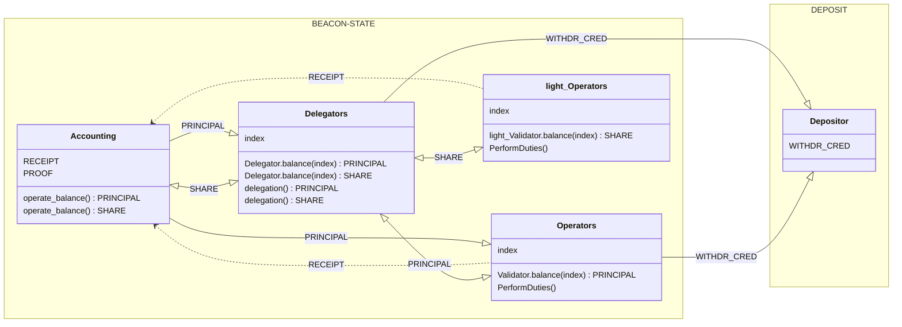

# eODS (enshrined Operator-Delegator Separation) design notes

## 1. Motivation

Today, ETH delegators allocate their principal to node operators off-protocol, via staking pools. 

In current Ethereum, capital providers do not actively participate in Consensus. We can improve this by allowing the Protocol to identify delegated stake and incentivize the Delegator role selection.

Allowing in-protocol delegations and having a meaningful role for delegators is a health indicator of any staking system. The current role principal providers play in delegated proof-of-stake is limited to voting within pools, which ultimately is just [a flawed type of voting](https://notes.ethereum.org/@vbuterin/staking_2023_10#Expanding-delegate-selection-powers).
  
## 2. The current status of delegations
In regards to enshrining delegations in the context of Ethereum staking, at least to the author's knowledge, there is no ongoing research or design reaching community consensus.

ETH holders currently delegate through staking pools; the existing mechanics of Ethereum staking have been analyzed in a myriad of papers and posts by many brilliant minds. This document will not add to that, however, I recommend as a prerequisite, 4 readings: a series of three posts by Barnabé Monnot, analizing the Principal-Agent accountability naturally forming off-protocol under today's liquid staking forces:
 - [Semantics of Staking 1: Liquefaction](https://mirror.xyz/barnabe.eth/v7W2CsSVYW6I_9bbHFDqvqShQ6gTX3weAtwkaVAzAL4), [[archived]](https://web.archive.org/web/20240417045323/https://mirror.xyz/barnabe.eth/v7W2CsSVYW6I_9bbHFDqvqShQ6gTX3weAtwkaVAzAL4)
 - [Semantics of Staking 2: Re-staking](https://mirror.xyz/barnabe.eth/96MD_A194uXLLjcOWePW3O2N3P-JG-SHtNxU0b40o50), [[archived]](https://web.archive.org/web/20240317094821/https://mirror.xyz/barnabe.eth/96MD_A194uXLLjcOWePW3O2N3P-JG-SHtNxU0b40o50)
 - [Semantics of Staking 3: Advanced Constructions](https://mirror.xyz/barnabe.eth/62E79gUSqiwS9NEbbfdwTdy7G9Hh098fcV38vWv8VQo), [[archived]](https://web.archive.org/web/20240522111709/https://mirror.xyz/barnabe.eth/62E79gUSqiwS9NEbbfdwTdy7G9Hh098fcV38vWv8VQo)

The series analyzes the off-protocol and in-protocol mechanisms and constructions of staking, re-staking, liquid staking, node operators, capital providers, and others, starting from the protocol’s own staking mechanism.

and the eODS write-up from EPF Study Group.

- [Enshrined Operator-delegator separation (eODS)](https://epf.wiki//#/wiki/research/eODS), [[archived]]()

### 2.1 Key takeaways from the prerequisite readings:

- Since the early days of Beacon Chain, market structures enabling to provide liquidity for staking pools without running an actual validator software have emerged in Ethereum.
Thus, staking has split naturally in two classes of participants, outside protocol level:

|    Tier    |                                                        Current natural separation                                                        | Slashing risk |
|:----------:|:----------------------------------------------------------------------------------------------------------------------------------------:|:-------------:|
| Delegators |   ETH stakers with no minimum commitment and no strict requirement to participate in any other way beyond bringing in their principal    |   Slashable   |
| Operators  | Node operators, home staking or providing validator services, with their reputation or some fixed amount of capital of their own at risk |   Slashable   |

- Despite the existence of a diverse set of actors in the staking scene, e.g.node operators, capital providers, staking pools, validators, the protocol only "sees" Validators.
- The Protocol can't control what it does not see.
- Identifying and distinguishing between the key entities participating in staking, re-staking and liquid staking allows us to develop automated defense systems the protocol can use to better protect itself from adversary models around centralization in staking and MEV.
- In Ethereum liquid staking, the stakeholders naturally developed off-protocol accountability constructions, that can be illustrated as balance sheets, keeping track of the *inter partes* assets and liabilities.

## 3. The proposed solution
eODS provides ETH holders, with an explicit, in-protocol mechanism to deposit and delegate their principal. Capital providers can then delegate stake to a targeted validator (node operator), thus allowing for delegators to be opinionated in their operators of choice. In a functional enshrined delegation mechanism, ETH holders will have a direct relation with their delegates, the validators (operators) executing the Protocol, thus mitigating the "grip" liquid staking has over staking.

eODS also proposes a solution to the long-term key question of "what’s the intended Etherean way for the large ETH holders that want return for their participation in protocol”. Delegators *in this model* can participate in a lighter way, but still meaninfull way than a full staking operation, by:

- Delegating capital towards FFG services provision (Slashable stake). 
FFG here is used more generally, in the context of protocol finality, i.e. GASPER + LMD-GHOST
    
- Re-delegating capital towards AVS services provision (Non-slashable stake)
    
>*When a party re-stakes, they commit to the provision of an “actively validated service” (AVS). In this model,[..] re-staking into light services may not burden you with slashing conditions, yet would offer rewards for good service provision.
So we claim that the model [..] is a partial enshrinement of re-staking, in the sense that we determine a “special” class of protocol AVS for which rewards are issued from the creation of newly-minted ETH. We then allow holders of ETH to enter into the provision of these services, either directly as operators, or indirectly as delegators.* - from "Towards rainbow staking" [ethresearch paper](https://ethresear.ch/t/unbundling-staking-towards-rainbow-staking/18683#economics-of-light-services-5).

In order to avoid single point of failure scenarios, enshrining delegations can be introduced as a parallel functionality to today's *Deposit - Validator activation - Validator duties* pipeline. 

## 4. What eODS is NOT

eODS does not imply the exclusive use of delegated PoS over undelegated PoS, the two should co-exist.

:::info
Although eODS might modify the actions set of validators, it DOES NOT change the way a validator participating in the Ethereum proof-of-stake protocol is expected to act, according to Phase 0 -- Honest Validator specification.
:::

## 5. eODS Prototyping

We identify a basic suite of features essential for any viable implementation for introducing in-protocol delegations. By deciding on basic design constraints, the range of potential solutions becomes narrowed.

### 5.1 The main entities under eODS
The Validator role will be unbundled in two separate protocol entities:

* **Delegator** - an optional protocol role for ETH holders that want to participate in a way that is lighter than a full staking operation, but still meaningful.
* **Operator** - a protocol role equivalent to today's node operators, running consensus validators and executing the Protocol. Operators are accountable to Delegators in the context of delegated proof-of-stake.

    Depending on the type of validators they will be running, Operators will be split into two tiers:

    * heavy Operators, running heavy Validators participating in protocol Finality and securing the chain. For simplicity and correspondence with the current PoS, we can use "Operators" and "Validators" notation instead.
    * light Operators, running light Validators participating in non-Finality (light) Protocol services providing. Light Validators in this model, are not a new beacon-chain class. Strictly code related, light validators could be the same `class Validator` with their own participation flags and signature domains.

* **Accounting protocol object** - keeps track of balance sheets and operations in the beacon state and executes operations based on predefined conditional relations defined further down. 

### 5.2 What is the minimum set of requirements for eODS design?
- New DELEGATION_CONTRACT. The events of this contract will be parsed in-protocol the same way the DEPOSIT_CONTRACT's events are currently parsed.
- New entity in beacon state: Delegators as a new class, with unique signature domain. 
- Mapping in-protocol Principal-Agent relationship by explicitating an accounting protocol object, that manages the balance sheets of *assets* and *liabilities* between parties, based on predefined conditional relations.
- Allow for delegator triggered `0x01` withdrawals.
- Define actions set/ attributes for light Validators. 

### 5.3 High level view of eODS
:::warning
The diagrams also contain the current protocol functionality for funding Validators:

DEPOSIT_CONTRACT -> ACCOUNTING (PRINCIPAL)-> OPERATORS(VALIDATORS)

Check cap **6.2 New Delegator, with the intent to delegate to heavy Operators and light Operators** for eODS functionality alone.
:::
##### DEPOSITS

##### Delegations towards Operators and light Operators, running Validators and respectively light Validators (for FFG and respectively, for AVS provision)

### 5.4 Terminology

#### DELEGATION_CONTRACT
A central DELEGATION_CONTRACT, deployed in a protocol-legible format, similar to the current DEPOSIT_CONTRACT

#### ENTITY
Any of the actors in the eODS construction, as shown in chapter 4.1. Can be Delegator, heavy Operator, or light Operator. It can also be the Accounting protocol object.

#### ACCOUNTING

The accounting is operated by the **Accounting protocol object** that keeps track of balance sheets in the beacon state and executes operations based on Predefined conditional relations.

It's called "object", in the attempt to specificate the accounting part as an ENTITY of the overall system, that can act based on predefined logic. In practice, Accounting is just the group of protocol functions that keep the protocol's accounting. This part already exists under the current protocol, embodied by Beacon operations, or Beacon state mutators, like `process_deposit`, `increase_balance`. 
The "accounting" term is used in the strictly etymological way it came to be used inside Ethereum protocol, i.e. Altair fork introduced the "accounting reforms" 
For the scope of prototyping the feature, I felt it would be useful to group these functions in a virtual group based on functionality (i.e. accounting) rather than beacon-chain specification container appartenance.

The default "behaviour" of the Accounting object is the current protocol's "behaviour" in matters of operations and internal accounting. Chapters 5.6 Conditional inter-partes relations and 5.5 Design constraints, present how Accounting manages balance sheets between parties, and what proposed changes eODS brings to current protocol accounting.

#### ASSETS
The most basic “type” of eODS semantics is that of an **asset**.

There are three accepted assets types in the proposed construction: 

##### 1. TOKEN-type ASSETS

There are three accepted token-type assets:

- **ETH**, the native token of the Ethereum network, deposited in the delegation contract or the deposit contract, with the purpose of being staked. 

- **PRINCIPAL**, a virtual asset representing the virtual balance of depositors, received in the protocol's consensus layer, against which, the staker's ETH is redeemable. It's the equivalent of today's validator balance in the beacon state.
Delegators can transfer PRINCIPAL to operators with the intent of being staked in FFG.

- **SHARE**, a virtual asset representing the virtual balance of delegators, received in the protocol's consensus layer, against which, the delegator's PRINCIPAL balance is redeemable. 
It represents a share of the delegated PRINCIPAL, and can be "re-delegated" by Delegators towards light Operators with the intent of being staked in AVS.

##### 2. RECEIPT
A minted receipt that stands as a liability against Entity B, in the case of Entity A transferring ASSET to Entity B. It acts like a claim, allowing Entity A to eventually redeem ASSET, by running the same order of operations, backwards.

##### 3. PROOF
Similar to RECEIPT, but proving a certain action or event, that is not ASSET transfer (as in the case of an RECEIPT), e.g. a DEPOSIT_CONTRACT event parsed in protocol. 

It can also be proof of ownership over a certain balance or delegated ASSETs, i.e. withdrawal credentials.

#### LIABILITY
A liability is the opposite of an ASSET, referring to things that are owed or borrowed. Assets are things that are owned.

#### BALANCE SHEETS

Balance sheets show the creation and transfer of assets between multiple involved entities.

Balance sheets will be used in the Workflow Diagram. I preserved the practical format used in the "Semantics of staking" paper:

>- The first row represents the “pre-state”, denoting which assets are currently owned by each party.
>- The last row represents the “post-state”, denoting which assets are owned by each party after all operations have concluded.
>- The rows in between represent operations, with a new row simply denoting a new set of operations, divided from the others for the purpose of exposition.

#### OPERATIONS 

There are two basic operations that take place repeatedly:
- ASSET transfer
    - Entity A transfers ASSET to Entity B

- RECEIPT (claim) && PROOF (proof of a certain event), minting
    - Entity A receives a claim or a proof from Entity B, allowing Entity A to redeem ASSET from Entity B. The claim becomes a LIABILITY for Entity B, and an ASSET for Party A. Receipts and Proofs can be used further as ASSETs that will mint new liabilities, based on the *inter partes* Conditional Relations.

     

#### TERMINOLOGY HIGHLIGHTS

|Term|Type|Short description|Usage|
|---|---|---|---|
|PRINCIPAL|ASSET|Represents the virtual balances of Depositors, in the consensus layer| Used for backing Operators to fund Validators |
|SHARE|ASSET|Represents the virtual balances of Delegators in the consensus layer| Used for backing light Operators to fund light Validators |
|RECEIPT|CLAIM|Represents a claim held by the entity that initiated an asset transfer, against the receiving entity, allowing the former to eventually redeem the asset| Used for assets redeeming, by running the same order of operations that led to assets being transfered, only backwards.
|PROOF|PROOF|Represents the proof of a certain action or event| Used in Accounting to track balance sheets operations, other than asset transfer|

### 5.5 Design constraints

* Operators run Validators to execute Consensus (Finality), as they do today. Validators are funded with PRINCIPAL. Rewards, penalties and slashing apply as today.

* light Operators run light Validators to execute light Consensus (Non-Finality protocol services). light Validators are funded with SHARE. For AVS, only rewards and penalties apply, no slashing.

    **PROOF** types:
    - deposit proof, minted when new DEPOSIT_CONTRACT or DELEGATION-CONTRACT deposit events are parsed in-protocol. The proof is minted as liability in the balance sheet of deposit/ delegation contracts and considered as asset in the beacon state (accounting)'s balance sheet.
    - delegation proof minted when an Operator receives PRINCIPAL as delegation from a Delegator, with the intent to fund a validator and participate in FFG. Same apply when a light Operator receives SHARE as delegation from a Delegator, with the intent to fund a light validator and participate in AVS. In both cases, the proof is minted as liability in the balance sheet of operators / light operators and considered as asset in the beacon state accounting balance sheet.
    - withdrawal credentials, minted when PRINCIPAL is received as ASSET in the balance sheet of *i.* Validators in undelegated PoS construction and *ii.* Delegators in the delegated PoS. Minted as proof of ownership, withdrawal credentials appear as liability in the balance sheet of validators / delegators and as asset in the depositor's balance sheet, in both delegated and undelegated PoS constructions. In practice this means that the depositor MUST always end up holding the withdrawal credentials.
    - internal withdrawal credentials receipt. It's minted when a delegation proof is received as asset in the beacon state accounting balance sheet, after a SHARE delegation from Delegators towards light Operators with the intent to fund a light validator and participate in AVS. In practice this means that the delegator MUST always end up holding the internal withdrawal credentials.

    **PRINCIPAL** is minted as liability in the balance sheet of beacon state Accounting, when a PROOF of the DEPOSIT_CONTRACT / DELEGATION_CONTRACT deposit event is received, and considered an asset in the balance sheet of
    - i. Validators if the current process of depositing in the DEPOSIT_CONTRACT followed by validator activation is used to fund validators. For the scope of eODS, we call this construction undelegated PoS, because even though the capital may come from a staking pool as well as from a solo staker, the Protocol does not "see" this as delegation.
    - ii. Delegators if the new process of depositing in the DELEGATION_CONTRACT followed by delegation to a delegate operator is used to fund validators. For the scope of eODS, we call this construction delegated PoS.

    **SHARE**, is minted as liability in the balance sheet of beacon state Accounting, when the RECEIPT of PRINCIPAL being transfered by Delegators towards delegated Operators is received. SHARE is then considered an asset in the balance sheet of Delegators.

    **ACCOUNTING & WITHDRAWALS**
    
*    If an delegated or undelegated Operator running  Validators performs its FFG consensus duties adequately, the Ethereum protocol credits its balance of PRINCIPAL with newly minted PRINCIPAL. Conversely, when the Operator receives penalties or is slashed, the protocol debits its PRINCIPAL balance.

*    If an delegated or undelegated light Operator running light Validators performs its light consensus (AVS) duties adequately, the Ethereum protocol credits its balance of SHARE with newly minted SHARE. There is no slashing for light consensus.

*    An ENTITY owning WITHDRAWAL CREDENTIALS or a RECEIPT, can redeem deposited or delegated ASSETs, by running backwards, the same order of operations that led to ASSET being transferred to another entity, thus:

        *    Depositors with the proper withdrawal credentials have the option to withdraw their PRINCIPAL they have inside the protocol in the form of a Delegator's balance, against ETH, at parity (1:1), in both delegated and undelegated PoS.
        *    When the Delegator wishes to withdraw their SHARE balance against the delegated PRINCIPAL from the delegated Operator, the withdrawal is NOT processed 1:1, i.e., for x units of SHARE, the Delegator might receive different that x PRINCIPAL in return, because even though SHARE - PRINCIPAL rate is 1:1, Operators work for a fee, and there is also a *tripartite* compensation to be done between Delegator, Operator and protocol Accounting, in matters of:
          
                - accounting for execution layer rewards e.g., priority fees and MEV, that accrue directly in the Operator's execution layer address. 
                - light protocol rewards that would derive from light Operators performing AVS (e.g. CR services like Inclusion Lists), with the Delegator's SHAREs. These attributes would still be payed by the protocol Accounting towards Validators, as eODS does not propose changing the rewards scheme, but since the protocol credits light operators balances with newly minted SHAREs for light protocol services providing, the Delegators will have more SHARE to withdraw than the delegated PRINCIPAL, so the AVS rewards will be compensated towards Delegators, at SHARE withdrawal against Operators owned PRINCIPAL.
                
        *    When the Delegator wishes to withdraw their delegated SHARE balance from the delegated light Operator, the in-protocol withdrawal is NOT processed 1:1, either, because light Operators work for a fee, that needs to be accounted for. 

### 5.6 Conditional inter-partes relations

#### Between Depositor and Validator
The balance sheet of the current deposit process in nondelegated PoS. Depositor and Validator are considered to be the same physical entity.

#### Between Depositor and Delegator
The balance sheet of the proposed deposit process in delegated PoS. Depositor and Delegator are considered to be the same physical entity.

#### Between Delegator and Operator
The balance sheet of the proposed delegation process in delegated PoS, of a Delegator backing-up an Operator with the intent to fund a validator and participate in FFG. Delegator and Operator are not necessairly the same physical entity.

#### Between Delegator and light Operator
The balance sheet of the proposed delegation process in delegated PoS, of a Delegator backing-up a light Operator with the intent to fund a light validator and participate in AVS. Delegator and Operator are not necessairly the same phisical entiy.

### 5.7 Validator actions set

The actions set of Validators would be reduced by transferring the Censorship Resistance protocol services e.g. IL, and other non-FFG attributes to the light Validator's actions set.

#### Non-Finality attributes in Consensus

We can list a number of current (and in research i.e. CR), Validator attributes that could be removed from the Validator actions set and added to light Validator actions set:
- Sync-committee
- FOCIL
- Whistleblower

### 5.8 Class Diagram

### 5.9 Delegations

Delegators can only delegate:

- PRINCIPAL to Operators running Validators
- SHARE to light Operators running light Validators

:::warning
The two types of delegations (for the provision of FFG and AVS protocol services) MUST happen consecutively and the invalidation of one MUST attract the invalidation of the other. 
This is to generate "transferability" of the responsibility to run light Consensus and avoid cases where a Delegator delegates to a FFG Validator, but does not re-stake for AVS, so there would be no corresponding light Consensus validator running light protocol services.
:::

### 5.10 Validator activation
Under this eODS model, there are two paths of validators entering activation queue:

An undelegated way 

1. Validators enter the activation queue the way it's being done today, after a DEPOSIT_CONTRACT event has been validated in CL. 

And a delegated way

2. Validators enter the activation queue, after a DELEGATION_CONTRACT deposit has been validated in CL, and a valid PRINCIPAL delegation message containing the targeted Validator's pubkey has been included in a beacon block.

### 5.11 Light Validator activation

Light Validators enter the activation queue, after a valid SHARE delegation message containing the delegated light Validator's pubkey has been included in a beacon block.

## 6. Use cases
### 6.1 New self-funded heavy operator
This case study is straightforward, as it depicts the current Deposit - Validator funding - Validator performing duties process, which eODS does not propose to be modified, as eODS is rather a parallel, opt-in functionality.

### 6.2 New Delegator, with the intent to delegate to heavy Operators and light Operators

**WORKFLOW**

#### 6.2.1 Deposit
 - Capital provider deposits funds in DELEGATION_CONTRACT
 
#### 6.2.2 Constitute Delegator's balance
 - Deposit event is parsed into the beacon-chain's Accounting, in order to `apply_deposit`
 - New `class Delegator` in beacon-chain
 - Delegator is assigned the next available `DelegatorIndex` and accounting increases the Delegator's `PRINCIPLE` balance with the deposited amount, if the pubkey used in the deposit process does not match any existing Delegator from the BeaconState registry. Subsequent deposits made using the same `pubkey` will compound to the Delegator's balance. 

#### 6.2.3 Delegation towards Validators 

When delegating in protocol, the delegator's balance (the PRINCIPAL) is being transferred to the delegate but a mapping of the delegation is created in the Delegator's accounting records.

- Delegator sends a `DelegationMessage` on the p2p network that contains the validating public key and the index of a delegate validator. The message will also contain the Delegator's BLS pubkey and withdrawal credentials, in order to verify the signature of the sender and the commitment to pubkey for withdrawals purposes. The delegation message will be signed over with the delegator's BLS signature. 

- Proposers listening to eODS gossip, would include delegation messages in a block and as soon as the block is included on-chain, the delegate validator receives the PRINCIPAL. The Delegator's SHARE balance in the BeaconState is credited with the same `amount` by the Accounting protocol object.

#### 6.2.4 Delegation towards light Validators

Delegators re-delegate stake by transferring their SHARE balance to light Validators. The process is identical to delegating towards Validators, by sending a `DelegationMessage` containing the public key and the index of a delegate validator, on the p2p network. 

#### 6.2.5 Actions set/ attributes of Validators and light Validators
As mentioned in cap. 5.7, we can list a number of current (and in research i.e. CR), Validator attributes that could be removed from the Validator actions set and added to light Validator actions set, like:

- Sync-committee
- FOCIL
- Whistleblower

Since light_Validators in this model, are funded with SHARE, which is re-delegated PRINCIPAL (stake), let us consider the light protocol services, as AVS services. For participating in protocol AVS, light_Validators receive rewards that are issued from the creation of newly-minted SHARE. 

More research is needed on this topic, in order to asses IF and WHICH of these, or other attributes can be SAFELY abstracted from the Validator actions set, into the light Validator's actions set. 
 
:::info
Inclusion lists and ePBS are in active research, and at least at this moment, the first FOCIL iteration seems to be based on an altruistic IL committee participation. This might change in time. Attesters receive one full attestation for evaluating the IL aggregate, as is the case for PTC committee in ePBS.
:::

##### Protocol services provision

### 6.3 Current protocol + eODS functionality

## 7. What are the trade-offs for implementing the proposed solution?
- added complexity
- increased state - cost of storage, of signature calculation
